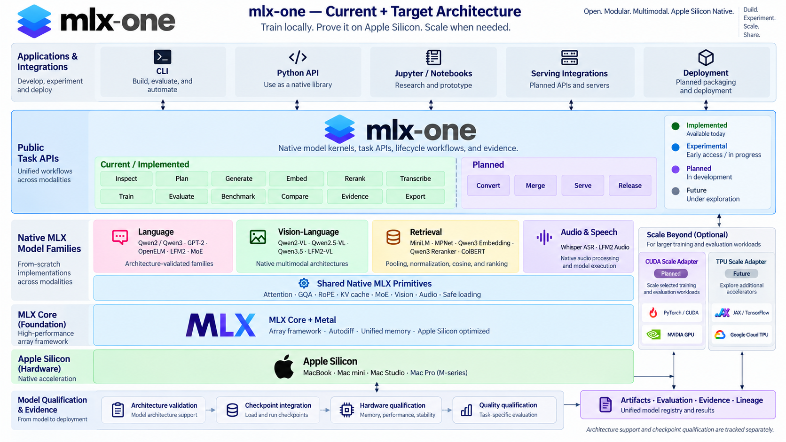

<p align="center">
  
</p>

<h1 align="center">mlx-one</h1>

<p align="center"><strong>Train locally. Prove it on Apple Silicon. Scale when needed.</strong></p>

<p align="center">
  Inspect, plan, train, evaluate, benchmark, and preserve reproducible model evidence
  through one CLI and Python package.
</p>

<p align="center">
  <a href="https://github.com/SSusantAchary/mlx-one/actions/workflows/ci.yml"></a>
  <a href="https://www.python.org/"></a>
  <a href="LICENSE"></a>
  
</p>

> [!IMPORTANT]
> The released package remains `v0.1.0a1`. Current `main` includes experimental
> text evaluation, comparison, benchmarking, dataset, and MLX SFT workflows.
> Hardware-dependent training is not a verified support claim until its exact
> model, revision, workload, runtime, and hardware evidence is published.

`mlx-one` is a model-size-agnostic workflow and evidence layer for local AI. It
uses MLX and the MLX model packages as execution engines, while owning the parts
that need to remain consistent across a model lifecycle: schemas, hardware
planning, safety policies, orchestration, evaluation protocols, run lineage,
comparison, and compatibility evidence.

```text
Discover → Inspect → Plan → Train → Convert → Verify → Benchmark → Gate → Ship
```

## Table of contents

- [Why mlx-one](#why-mlx-one)
- [Architecture](#architecture)
- [Installation](#installation)
- [Quick start](#quick-start)
- [Model inspection](#model-inspection)
- [Hardware planning](#hardware-planning)
- [Capability registry](#capability-registry)
- [Dataset validation](#dataset-validation)
- [Fine-tuning](#fine-tuning)
- [Evaluation and comparison](#evaluation-and-comparison)
- [Benchmarking](#benchmarking)
- [Python API](#python-api)
- [Reference M4 results](#reference-m4-results)
- [Project status](#project-status)
- [Development](#development)

## Why mlx-one

- **One workflow, multiple engines.** MLX-LM, MLX-VLM, MLX-Audio, and
  MLX-Embeddings remain the model runtimes.
- **Evidence-scoped compatibility.** Support belongs to an exact revision,
  operation, precision, workload, runtime, and hardware profile—not a model name
  or parameter count alone.
- **Measured is not estimated.** Metrics explicitly carry `measured`,
  `estimated`, or `not-available` provenance.
- **Local-first.** Datasets, prompts, checkpoints, and generated content remain
  local unless the user explicitly publishes them.
- **Safe Apple Silicon qualification.** Expensive work runs in isolated workers
  with preflight memory estimates and preserved failure evidence.
- **Two training surfaces, one implementation.** The native API is authoritative;
  the Unsloth/TRL-shaped facade is an explicitly supported subset.

## Architecture

<p align="center">
  
</p>

The diagram separates the current native MLX path from the planned CUDA adapter
and future accelerator candidates. Status labels describe the repository today;
displayed future paths are product direction, not compatibility claims. The
capability registry and project-status table below remain authoritative.

## Installation

### Development installation

```bash
git clone https://github.com/SSusantAchary/mlx-one.git
cd mlx-one
python3 -m venv .venv
source .venv/bin/activate
python -m pip install -e ".[dev]"
```

### Optional model backends

Install only the modality integrations you need:

```bash
python -m pip install -e ".[vlm]"         # mlx-vlm
python -m pip install -e ".[audio]"       # mlx-audio
python -m pip install -e ".[embeddings]"  # mlx-embeddings
python -m pip install -e ".[multimodal]"  # all modality backends
python -m pip install -e ".[tracking]"    # optional MLflow integration
```

Quote extras in `zsh` so square brackets are not expanded as a glob.

## Quick start

Check the host, inspect a model without loading its weights, and create a
metadata-only memory plan:

```bash
mlx-one doctor

mlx-one inspect Qwen/Qwen2.5-1.5B \
  --revision 8faed761d45a263340a0528343f099c05c9a4323

mlx-one plan inference \
  --model Qwen/Qwen2.5-1.5B \
  --revision 8faed761d45a263340a0528343f099c05c9a4323 \
  --hardware m4-air-32gb \
  --context-length 2048 \
  --batch-size 1
```

These commands do not initialize MLX or materialize weight tensors.

## Model inspection

Inspect Hugging Face repositories or local model directories without executing
remote code or opening pickle-based weights:

```bash
mlx-one inspect mlx-community/Qwen3-0.6B-4bit
mlx-one inspect mlx-community/Qwen3-0.6B-4bit --revision main --json-output
mlx-one inspect ./local-model --output inspection.json
mlx-one inspect organization/cached-model --offline
```

Inspection reports:

- resolved revision and model identity;
- modality, architecture, and transformer dimensions;
- parameter-count provenance;
- formats, dtypes, quantization, and weight size;
- tokenizer or processor metadata;
- license, access restrictions, and remote-code requirements;
- cautious backend hints and missing metadata warnings.

Backend hints are candidates only. They are not compatibility claims.

## Hardware planning

List the bundled hardware profiles or detect the local machine without collecting
serial numbers, hardware UUIDs, usernames, or private paths:

```bash
mlx-one hardware list
mlx-one hardware show m4-air-32gb
mlx-one hardware detect --json-output
```

Plan inference or training without loading the model:

```bash
mlx-one plan inference \
  --model Qwen/Qwen2.5-1.5B \
  --hardware m4-air-32gb \
  --precision bf16 \
  --context-length 2048

mlx-one plan train \
  --model Qwen/Qwen2.5-3B \
  --hardware m4-air-32gb \
  --method auto \
  --context-length 2048 \
  --output plan.json
```

The estimator returns lower, central, and upper memory estimates, component
breakdowns, fit status, confidence, assumptions, warnings, and calibration
references. Automatic planning considers full tuning, BF16 LoRA, then 4-bit
QLoRA. Estimates are guidance, not proof that a workload will fit.

## Capability registry

The registry stores operation-level evidence for exact model revisions:

```bash
mlx-one registry list

mlx-one registry list \
  --model Qwen/Qwen2.5-1.5B \
  --operation benchmark
```

Supported states are:

| State | Meaning |
| --- | --- |
| `candidate` | Metadata suggests a possible integration; not tested |
| `upstream-documented` | The execution backend documents support |
| `integration-tested` | The mlx-one adapter contract passed |
| `hardware-verified` | A checksummed device run passed its safety policy |
| `quality-verified` | A pinned evaluation protocol passed |
| `unsupported` | The exact operation is known not to work |
| `deprecated` | Previously supported evidence is no longer current |

Failed, interrupted, skipped, and safety-invalidated calibration records cannot
be promoted to verified capability entries.

Validate, import, or promote local registry evidence explicitly:

```bash
mlx-one registry validate registry.json
mlx-one registry import --entry candidate.json --registry registry.json
mlx-one registry promote --entry candidate.json --result runs/id/result.json \
  --status hardware-verified --registry registry.json
```

See the [candidate model catalog](docs/model-catalog.md) for the targets selected
from `model_list.txt`.

## Dataset validation

The text pipeline supports local JSON and JSONL records in four layouts:

| Layout | Required fields |
| --- | --- |
| `instruction` | `instruction`, optional `input`, and `output` or `response` |
| `messages` | OpenAI-style `messages`, ending with an assistant response |
| `prompt-completion` | `prompt` and `completion` |
| `text` | `text` |

Validate structure without starting MLX:

```bash
mlx-one data validate \
  --dataset examples/text-sft/train.jsonl \
  --layout prompt-completion
```

Add `--tokenizer MODEL` to preview token counts, truncation, and response-only
loss masks. The preview reports shapes and counts without printing private record
content.

## Fine-tuning

> [!WARNING]
> Training on current `main` is experimental. Run it from a local Apple Silicon
> terminal, start with the planner, and keep other memory-heavy applications
> closed. The current supported method set is LoRA plus QLoRA for an explicitly
> verified 4-bit base.

Create a strict versioned configuration:

```yaml
schema_version: "1.0"
output_dir: runs/qwen-coder-sft
method: lora
max_seq_length: 512
batch_size: 1
gradient_accumulation_steps: 1
max_steps: 10
learning_rate: 0.0002
optimizer: adamw
seed: 42
lora_rank: 8
lora_alpha: 16.0
lora_dropout: 0.0
lora_layers: 16
target_modules: []
gradient_checkpointing: false
save_steps: 10
eval_steps: 0
metadata:
  purpose: integration-smoke
```

Run the pinned model through the isolated MLX worker:

```bash
mlx-one train \
  --model Qwen/Qwen2.5-Coder-1.5B-Instruct \
  --revision 2e1fd397ee46e1388853d2af2c993145b0f1098a \
  --dataset examples/text-sft/train.jsonl \
  --config examples/text-sft/train.yaml
```

Training writes an atomic run result, adapter checksum, base-model ancestry, and
checkpoint manifest. Adapter-weight continuation is supported with
`--resume-from`; cross-backend optimizer, scheduler, and RNG-state portability is
not claimed.

Export a validated adapter bundle without overwriting an existing destination:

```bash
mlx-one export \
  --checkpoint runs/qwen-coder-sft/adapters/mlx-one-checkpoint.json \
  --output artifacts/qwen-coder-sft
```

### Compatibility facade

The supported Unsloth-shaped subset maps to the same MLX primitives:

```python
from mlx_one import FastLanguageModel

model, tokenizer = FastLanguageModel.from_pretrained(
    model_name="Qwen/Qwen2.5-Coder-1.5B-Instruct",
    revision="2e1fd397ee46e1388853d2af2c993145b0f1098a",
    max_seq_length=512,
)

model = FastLanguageModel.get_peft_model(
    model,
    r=8,
    lora_alpha=16,
    target_modules=["q_proj", "v_proj"],
)
```

Unsupported compatibility arguments raise an error instead of being ignored.

Run the complete reference lifecycle as a resumable workflow:

```bash
mlx-one workflow text-sft \
  --config examples/text-sft/qwen2.5-coder-1.5b.workflow.yaml \
  --resume
```

Completed stages are recorded in `workflow.json` and are not repeated on resume.

## Evaluation and comparison

Pinned profiles include `text-exact-match-v1`, `text-coding-v1`,
`text-instruction-v1`, and `text-reasoning-v1`. Results retain sample IDs,
inputs, predictions, exclusions, and a 95% Wilson confidence interval.

### Evaluate precomputed predictions

Evaluation records contain `prompt` and `reference`. Predictions are a JSON array
of strings or JSONL objects with a `prediction` field:

```bash
mlx-one evaluate \
  --model Qwen/Qwen2.5-Coder-1.5B-Instruct \
  --revision 2e1fd397ee46e1388853d2af2c993145b0f1098a \
  --dataset examples/text-sft/eval.jsonl \
  --predictions examples/text-sft/predictions-smoke.json \
  --runs-dir runs \
  --run-id scoring-smoke \
  --json-output
```

### Generate and evaluate with MLX

Omit `--predictions` to load the pinned model in an isolated worker and generate
deterministic outputs. Pass `--adapter` to evaluate a fine-tuned adapter:

```bash
mlx-one evaluate \
  --model Qwen/Qwen2.5-Coder-1.5B-Instruct \
  --revision 2e1fd397ee46e1388853d2af2c993145b0f1098a \
  --adapter artifacts/qwen-coder-sft \
  --dataset examples/text-sft/eval.jsonl \
  --max-tokens 32 \
  --runs-dir runs
```

Each profile pins its scoring behavior, dataset revision, and generation
settings. Published general-purpose quality benchmark scores are not available
until real model runs pass the declared gates.

### Compare runs and apply gates

```bash
mlx-one compare \
  runs/base/result.json \
  runs/candidate/result.json \
  --gate examples/text-sft/quality-gate.yaml \
  --format markdown \
  --output comparison.md
```

Comparisons require identical profiles, dataset revisions, and generation
settings. `--allow-incompatible` permits inspection but cannot produce a passing
qualification result.

## Benchmarking

Measure load time, prompt throughput, decode throughput, wall time, and peak
Metal memory in an isolated process:

```bash
mlx-one benchmark inference \
  --model Qwen/Qwen2.5-Coder-1.5B-Instruct \
  --revision 2e1fd397ee46e1388853d2af2c993145b0f1098a \
  --prompts examples/text-sft/prompts.json \
  --max-tokens 32 \
  --repeats 3 \
  --runs-dir runs
```

For estimator calibration, the bundled matrix remains available separately:

```bash
mlx-one calibrate text \
  --matrix m4-air-32gb-text-v1 \
  --output calibration-results \
  --dry-run
```

Remove `--dry-run` only on the matching reference hardware. The runner preserves
OOM, worker failure, swap-limit, and memory-pressure outcomes as evidence.

## Python API

### Inspect and plan

```python
from mlx_one import (
    Precision,
    WorkloadKind,
    WorkloadSpec,
    estimate_memory,
    inspect_model,
    load_hardware_profile,
)

model = inspect_model(
    "Qwen/Qwen2.5-1.5B",
    revision="8faed761d45a263340a0528343f099c05c9a4323",
).model
hardware = load_hardware_profile("m4-air-32gb")
workload = WorkloadSpec(
    kind=WorkloadKind.INFERENCE,
    precision=Precision.BF16,
    context_length=2048,
)

estimate = estimate_memory(model, hardware, workload)
print(estimate.to_json())
```

### Native training contract

```python
from mlx_one import TrainConfig
from mlx_one.training import SFTTrainer

trainer = SFTTrainer(
    model="Qwen/Qwen2.5-Coder-1.5B-Instruct",
    revision="2e1fd397ee46e1388853d2af2c993145b0f1098a",
    train_dataset="examples/text-sft/train.jsonl",
    args=TrainConfig(
        output_dir="runs/qwen-coder-sft",
        max_seq_length=512,
        method="lora",
        max_steps=10,
    ),
)

result = trainer.train()
print(result.to_json())
```

### Modality loaders

```python
from mlx_one.utils.model_loader import (
    load_audio_model,
    load_embedding_model,
    load_model,
    load_vlm_model,
)

model, tokenizer = load_model("mlx-community/Qwen3-0.6B-4bit")
vlm, processor = load_vlm_model("mlx-community/Qwen2-VL-2B-Instruct-4bit")
asr = load_audio_model("mlx-community/parakeet-tdt-0.6b-v3", task="stt")
embedding, tokenizer = load_embedding_model(
    "mlx-community/all-MiniLM-L6-v2-4bit"
)
```

Optional loaders identify the exact package extra when a backend is missing.

## Reference M4 results

The first public calibration matrix uses an M4 MacBook Air with 32 GiB unified
memory and a 24 GiB MLX process budget. It pins Qwen2.5 0.5B, 1.5B, and 3B model
revisions across BF16/4-bit inference and BF16 LoRA/4-bit QLoRA at contexts 512,
1024, 2048, and 4096.

The matrix contains 48 cells:

- 44 completed;
- all 24 inference cells completed;
- two 4096-token BF16 LoRA cells completed but were invalidated by swap safety;
- the 3B LoRA and QLoRA 4096-token workers failed;
- all 2048-token workloads completed.

### Measured 2048-token performance

These are **device-performance measurements**, not model-quality scores. All use
batch size 1. Inference reports warm decode throughput; training reports warm
optimizer-step throughput.

| Model | BF16 inference | 4-bit inference | BF16 LoRA | 4-bit QLoRA |
| --- | ---: | ---: | ---: | ---: |
| Qwen2.5 0.5B | ✅ 88.7 tok/s · 1.49 GiB | ✅ 233.2 tok/s · 1.02 GiB | ✅ 894.3 tok/s · 7.54 GiB | ✅ 798.5 tok/s · 6.89 GiB |
| Qwen2.5 1.5B | ✅ 30.5 tok/s · 3.38 GiB | ✅ 93.0 tok/s · 1.51 GiB | ✅ 393.4 tok/s · 11.17 GiB | ✅ 333.9 tok/s · 9.11 GiB |
| Qwen2.5 3B | ✅ 15.3 tok/s · 6.20 GiB | ✅ 50.3 tok/s · 2.26 GiB | ✅ 176.5 tok/s · 15.62 GiB | ✅ 157.8 tok/s · 11.49 GiB |

Training and inference throughput measure different work and must not be compared
with each other.

### 4096-token compatibility boundary

| Model | Inference | BF16 LoRA | 4-bit QLoRA | Guidance |
| --- | --- | --- | --- | --- |
| Qwen2.5 0.5B | ✅ BF16 and 4-bit | ⚠️ Invalid: swap limit | ✅ 16.99 GiB peak | Prefer 2048 tokens for safer BF16 LoRA |
| Qwen2.5 1.5B | ✅ BF16 and 4-bit | ⚠️ Invalid: swap limit | ✅ 20.44 GiB peak | QLoRA runs near the 24 GiB budget |
| Qwen2.5 3B | ✅ BF16 and 4-bit | ❌ Worker failed | ❌ Worker failed | Reduce context or use larger training infrastructure |

See the [calibration methodology](docs/calibration.md) and
[published result records](calibration/results/m4-air-32gb-text-v1). Converted
weights, caches, prompts, generated text, verbose logs, and private machine
identifiers are not part of the evidence bundle.

### Measured LoRA workflow qualification

The first end-to-end LoRA qualification runs used the same M4 MacBook Air with
32 GiB unified memory, Python 3.12.11, MLX 0.32.2, and MLX-LM 0.31.3. Each run
used a pinned model revision, a 512-token maximum sequence length, and 10
training steps. These measurements use the `text-sft-v1` protocol and are not
comparable to the calibration matrix's warm optimizer-step throughput.

| Model | Immutable revision | Training loss | Throughput | Peak memory | Adapter update | Support state |
| --- | --- | ---: | ---: | ---: | --- | --- |
| Qwen2.5-Coder 1.5B Instruct | [`2e1fd397`](qualification/results/qwen2.5-coder-1.5b-lora-m4-air-32gb.json) | 6.522 → 0.004 | 25.18 tok/s | 3.51 GiB | ✅ verified | Hardware-verified |
| SmolLM2 1.7B Instruct | [`31b70e2e`](qualification/results/smollm2-1.7b-lora-m4-air-32gb.json) | 6.771 → 0.005 | 22.85 tok/s | 3.82 GiB | ✅ verified | Hardware-verified |

Both adapter bundles passed reload and deterministic inference smoke tests. The
first two-sample held-out coding comparison did **not** pass its quality gate:
Qwen scored 0.0 before and after adaptation, while SmolLM2 moved from 1.0 to
0.0. These tiny comparisons validate workflow behavior and failure preservation;
they do not establish model-quality improvement. Neither model is
quality-verified.

## Project status

| Milestone | Outcome | Status |
| --- | --- | --- |
| M0 / `v0.1.0a1` | Diagnostics, inspection, schemas, planning, calibration | ✅ released |
| M1 | Evidence registry, local runs, text evaluation, comparison | 🚧 experimental on `main` |
| M2 | Owned MLX SFT, LoRA, QLoRA, checkpoints, export | 🚧 LoRA training/export hardware-verified; held-out quality gate pending |
| M3 | CUDA source portability and conversion parity | 📋 planned |
| M4 | Embeddings and retrieval | 📋 planned |
| M5 | Vision-language and OCR | 📋 planned |
| M6 | ASR and TTS workflows | 📋 planned |
| M7+ | Optimization, advanced training, release qualification | 📋 planned |

The project is not restricted to models below 3B. That range reflects the
maintainer's current M4 32 GiB validation boundary, not an API limit. See the
[full roadmap](docs/roadmap.md).

The current M4 LoRA evidence verifies training and adapter reload for
Qwen2.5-Coder 1.5B and SmolLM2 1.7B. Their first tiny held-out quality comparisons
did not pass, so evaluation support remains candidate-only; see the
[checksummed qualification records](qualification/results).

## Development

Run the backend-free quality gates:

```bash
ruff check .
pytest -q
python -m build
python -m twine check dist/*
```

Model loading, generation, training, and hardware benchmarks require a real
Apple Silicon environment with Metal access and are isolated from ordinary unit
tests.

Contributions are welcome. Read [CONTRIBUTING.md](CONTRIBUTING.md) before opening
a pull request. Report vulnerabilities through [SECURITY.md](SECURITY.md), not a
public issue.

Released under the [MIT License](LICENSE).
