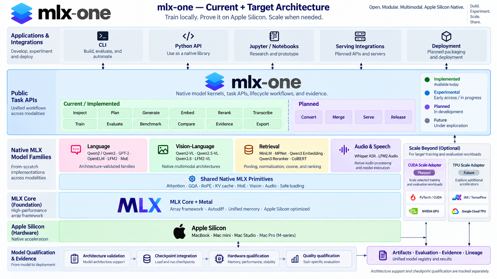

<p align="center">
  
</p>

<h1 align="center">mlx-one</h1>

<p align="center"><strong>Train locally. Prove it on Apple Silicon. Scale when needed.</strong></p>

<p align="center">
  A unified, native MLX stack for language, vision-language, embeddings,
  audio-language, speech, and segmentation models on Apple Silicon.
</p>

<p align="center">
  <a href="https://github.com/SSusantAchary/mlx-one/actions/workflows/ci.yml"></a>
  <a href="https://www.python.org/"></a>
  <a href="LICENSE"></a>
  
  
</p>

[**Quickstart**](#quick-start) | [**Installation**](#installation) | [**Model guides**](#model-specific-documentation) | [**Documentation**](docs/ui.md) | [**Examples**](#cli)

> [!IMPORTANT]
> mlx-one is under active development. Native architecture support and model
> qualification are tracked separately. A family marked Architecture ✅ has a
> validated config, MLX model structure, registry entry, strict weight contract,
> and synthetic execution tests. It does not automatically mean every checkpoint,
> task, precision, or device has been qualified.

## Why mlx-one?

MLX is an excellent foundation for machine learning on Apple Silicon, but model
workflows are often split across separate packages and incompatible task APIs.
mlx-one is building those pieces as one coherent stack:

```text
Python API + CLI
       ↓
Tasks: generation · embeddings · VLM · ASR · segmentation · tracking · training
       ↓
Native model families + shared processors + safe loading
       ↓
Evaluation · benchmarking · evidence · qualification
       ↓
MLX on Apple Silicon
```

<p align="center">
  <a href="mlx-one-stack.png">
    
  </a>
</p>

Click the architecture diagram to view it at full resolution.

The project owns its supported model math directly. Hugging Face is used as the
artifact ecosystem for configuration, tokenizer/processor assets, and safe
`safetensors` checkpoints—not as a remote-code execution runtime.

## Native inference engine

mlx-one now exposes a lifecycle-managed Python engine while retaining the
existing `generate()` and `stream_generate()` functions:

```python
from mlx_one import Engine

with Engine(model="mlx-community/LFM2-350M-4bit") as engine:
    result = engine.generate("Explain unified memory briefly.", max_tokens=128)
    print(result.text)

    for chunk in engine.stream("Name two advantages of MLX."):
        print(chunk.text, end="", flush=True)
```

The internal runtime includes explicit request/state/runner contracts, typed
cache bundles, byte-bounded prefix caching, token-budget scheduling policy,
unified-memory admission forecasting, and experimental block-cache allocation.
Continuous dense batching and paged attention stay capability-gated until their
correctness and M4 performance gates pass. See the
[native inference-engine roadmap](mlx-one_inference_engine.md).

## Cache runtime qualification

The current [M4/32 GB cache qualification report](docs/cache-benchmark-m4-32gb.md)
is a partial result; dense APC and block APC are not yet qualified.

- The backend-free cache, server, scheduler, allocator, and lifecycle suite
  passed: `357 passed, 14 skipped`.
- Native dense Qwen testing passed at approximately 2K and 8K context, passed
  with a memory limitation at 16K, and failed cleanly at approximately 32K after
  reaching about 28.2 GB peak MLX memory at 16K.
- The initial APC run produced four prefix misses, zero reused tokens, and zero
  avoided prefill tokens because the published snapshot boundary does not yet
  match the intended shared prompt prefix.
- Qwen block execution passed a basic smoke test, but token parity, shared-block
  ownership, and block APC remain unqualified.
- LFM2 hybrid block requests are explicitly rejected as unsupported; dense,
  parallel, and cancellation qualification remains pending.

Dense remains the recommended backend until the APC prompt-prefix boundary and
the remaining native Metal matrix pass.

## What is implemented

- Native MLX architectures across language, vision-language, embeddings,
  audio-language, ASR, and segmentation.
- Shared attention, GQA, RoPE, normalization, feed-forward, MoE, vision, hybrid
  convolution, masking, and KV-cache primitives.
- Lazy metadata-driven model registration without initializing Metal during
  lightweight package imports.
- Strict configuration validation and deterministic weight contracts that reject
  unknown or shape-incompatible tensors.
- Safe local and pinned Hugging Face artifact inspection.
- Native Whisper loading, audio preprocessing, tokenization, decoding, language
  detection, segment timestamps, word timestamps, and WER/CER evaluation.
- Unified native text loading, tokenizer/chat templates, MLX 4-bit checkpoints,
  cached greedy and seeded sampling, stop sequences, token streaming, and serving
  for GPT-2, Qwen2/Qwen3, LFM2, OpenELM, and text-only Qwen3.5 families.
- Native Qwen3 embedding and reranking with byte-level BPE, safe loading,
  padding-aware batching, Matryoshka dimensions, normalization, cosine similarity,
  yes/no pair scoring, and stable ranking.
- Native Meta SAM3 float32 loading, text/box concept segmentation, interactive
  point/box/mask prediction, experimental automatic masks, and stateful offline
  and streaming video tracking through Python and CLI. Qualification is partial;
  see the [SAM3 model guide](src/mlx_one/models/segmentation/sam3/README.md) and
  [M4/32 GB results](docs/sam3-qualification-m4-32gb.md).
- Dataset validation, memory planning, LoRA/QLoRA SFT workflows, adapter export,
  evaluation, comparison, benchmarking, and evidence records.
- Backend-free tests plus opt-in Metal and real-checkpoint integration gates.
- A context-managed `mlx_one.Engine` with streaming, asynchronous submission,
  cooperative cancellation, runtime capability inspection, and explicit cleanup.

## Installation

mlx-one requires Python 3.10 or newer and an Apple Silicon Mac for model
execution.

```bash
git clone https://github.com/SSusantAchary/mlx-one.git
cd mlx-one
python3 -m venv .venv
source .venv/bin/activate
python -m pip install -e .
```

Install development tools with:

```bash
python -m pip install -e ".[dev]"
```

The native engine and server do not require `mlx-lm`. Install
`mlx-one[legacy-mlx-lm]` only for legacy compatibility workflows that explicitly
request that bridge.

For SAM3 image processing, install the existing vision extra:

```bash
python -m pip install -e ".[vision]"
```

Meta's [SAM3 checkpoint](https://huggingface.co/facebook/sam3) requires authorized
gated access and acceptance of its separate checkpoint license. Authenticate with
`hf auth login`, or use an authorized complete local snapshot with `--offline`.
SAM3 runs in float32; quantized checkpoints and SAM3.1 are unsupported.

FFmpeg is required when the Whisper API receives an audio file; encoded SAM3
videos require both FFmpeg and ffprobe. Decoded mono 16-kHz waveforms, SAM3 frame
directories, and Python RGB frame iterators need no video/audio decoder.

## Quick start

### Native server and Web UI

Load one supported text model and start the bundled local UI:

```bash
python -m pip install 'mlx-one[server]'
mlx-one serve mlx-community/Qwen3.5-0.8B-4bit
```

<p align="center">
  <a href="mlx_One_chat_ui.png">
    
  </a>
</p>

Click the thumbnail to open the full-size UI screenshot.

To expose a shorter model name and protect `/v1/*` with a Bearer key:

```bash
mlx-one serve mlx-community/LFM2-350M-4bit \
  --host 127.0.0.1 \
  --port 8181 \
  --alias lfm2-local \
  --api-key local-secret
```

To enable the UI microphone and audio-file transcription, load a private native Whisper sidecar:

```bash
mlx-one serve CHAT_MODEL \
  --transcription-model WHISPER_MODEL \
  --host 127.0.0.1 \
  --port 8181
```

The Whisper model is loaded only when this flag is supplied. Recordings stay local, are
transcribed through MLX, and the editable transcript is inserted into the composer without being
sent automatically. FFmpeg is required for browser audio decoding.

Enter `local-secret` in the UI's **API key** field and select **Connect**. Terminal clients must
send the same key and use the alias as the request model:

```bash
curl http://127.0.0.1:8181/v1/models \
  -H 'Authorization: Bearer local-secret'

curl -N http://127.0.0.1:8181/v1/chat/completions \
  -H 'Authorization: Bearer local-secret' \
  -H 'Content-Type: application/json' \
  -d '{"model":"lfm2-local","messages":[{"role":"user","content":"Explain MLX in one sentence."}],"stream":true}'
```

Authentication is disabled when neither `--api-key` nor `MLX_ONE_API_KEY` is configured. A
`401 Unauthorized` response from `/v1/*` means the Bearer key is missing or invalid; `/health`
and the static UI remain public.

The native server also supports model aliases, optional Bearer authentication, effective context
limits, request deadlines, cooperative parallel slots, prompt/context caching, context shifting,
reasoning output, quantized KV caches, and Qwen3.5 MTP speculative decoding. Run
`mlx-one serve --help` for the complete flag list.

Cache Runtime V1 keeps dense KV as the default and exposes the Qwen2/Qwen2.5 block backend as an
opt-in experimental path:

```bash
mlx-one serve MODEL --cache-backend block --kv-block-size 32 \
  --kv-cache-budget-mib 8192 --prefix-cache-mib 512
```

The block backend currently requires unquantized f16 Qwen2/Qwen2.5 text generation with batch size
one. Unsupported combinations fail explicitly. Runtime cache ownership, memory, reservation, block,
and prefix statistics are included in `GET /v1/runtime`.

> [!WARNING]
> M4/32 GB qualification is incomplete. An unquantized Qwen2.5-0.5B dense run completed through
> 16K input tokens but failed at approximately 32K under the current memory budget. Dense snapshot
> APC did not reuse divergent chat-prompt suffixes, so block APC, block sharing, and dense/block
> parity are not qualified. Keep dense as the recommended backend; use block mode only for
> development testing. Hybrid LFM models reject block KV and APC intentionally. See the measured
> [cache qualification report](docs/cache-benchmark-m4-32gb.md) and
> [runtime support matrix](docs/cache-runtime.md).

Then open `http://127.0.0.1:8080`. The same process exposes an OpenAI-compatible API at
`http://127.0.0.1:8080/v1`, including streaming chat completions. Model execution remains inside
mlx-one's native model, tokenizer, sampling, generation, and MLX runtime. See
[the Web UI and server guide](docs/ui.md) for API and development details.

### Inspect, plan, and run tasks

Check the machine and inspect a model without loading its weights:

```bash
mlx-one doctor

mlx-one inspect Qwen/Qwen2.5-1.5B
```

Build a workload-aware memory plan:

```bash
mlx-one plan inference \
  --model Qwen/Qwen2.5-1.5B \
  --hardware m4-air-32gb \
  --precision bf16 \
  --context-length 2048
```

Generate text through the native GPT-2 stack:

```bash
mlx-one generate openai-community/gpt2 "The future of local AI is" \
  --max-tokens 64 \
  --temperature 0.8 \
  --top-p 0.95 \
  --seed 0
```

Use `--stream` for incremental text, `--json-output` for a structured result,
or `--offline` with an existing local/cache copy. Model downloads occur only
when a user explicitly supplies an online repository without `--offline`.

Transcribe audio through the native Whisper stack:

```bash
mlx-one transcribe openai/whisper-tiny recording.m4a \
  --language en \
  --word-timestamps \
  --json-output
```

Omit `--language` for automatic detection. Add `--task translate` for
speech-to-English translation or `--offline` to require local/cached assets.

Create document or instructed query embeddings:

```bash
mlx-one embed Qwen/Qwen3-Embedding-0.6B "A document to index" \
  --dimensions 512 \
  --json-output

mlx-one embed Qwen/Qwen3-Embedding-0.6B "local Apple Silicon training" \
  --input-type query
```

Rerank candidate documents while preserving their original indexes:

```bash
mlx-one rerank Qwen/Qwen3-Reranker-0.6B \
  "Which Macs support MLX?" \
  "MLX is designed for Apple silicon." \
  "CUDA targets NVIDIA GPUs." \
  --top-k 1 \
  --json-output
```

For reproducible evaluation and qualification, add `--revision` with an exact
model commit. Raw commit hashes are kept in integration tests and evidence
records rather than introductory examples.

## Model-Specific Documentation

Each registered model type has a guide beside its implementation, with checkpoint
assets, input formats, examples, settings, troubleshooting, and validation links.
The organization follows [mlx-vlm's model guides](https://github.com/Blaizzy/mlx-vlm/tree/main#model-specific-documentation);
the workflows below describe mlx-one's current implementation.

An available loader or integration gate is not a passing qualification result.
Examples marked as candidates require verification for the exact checkpoint and
workload. See [capability levels](#capability-levels) and the
[qualification candidate catalog](docs/model-catalog.md).

### Text generation guides

| Family | Available workflow | Qualification summary | Guide |
| --- | --- | --- | --- |
| GPT-2 | Completion, sampling, streaming | Candidate; synthetic validation | [Docs](src/mlx_one/models/language/gpt2/README.md) |
| Llama / MiniCPM5 / SmolLM2 | Completion, template chat, quantized loading | MiniCPM5 pinned gate; SmolLM2 M4 LoRA/reload evidence, quality gate failed | [Docs](src/mlx_one/models/language/llama/README.md) |
| Qwen2 / Qwen2.5 / Qwen2.5-Coder | Completion, template chat, streaming | Coder M4 LoRA/reload evidence, quality gate failed; cache qualification partial | [Docs](src/mlx_one/models/language/qwen2/README.md) |
| Qwen3 dense | Completion, template chat, streaming | Candidate; synthetic validation | [Docs](src/mlx_one/models/language/qwen3/README.md) |
| Qwen2-MoE | Experimental native text loading/generation | Architecture/synthetic; checkpoint unqualified | [Docs](src/mlx_one/models/language/qwen2_moe/README.md) |
| OpenELM | Completion with compatible tokenizer assets | Candidate; verify exact release | [Docs](src/mlx_one/models/language/openelm/README.md) |
| LFM2 / LFM2.5 | Hybrid text generation and chat | Per checkpoint; M4 block-rejection safety result | [Docs](src/mlx_one/models/language/lfm2/README.md) |
| LFM2-MoE | Experimental hybrid text loading/generation | Checkpoint unqualified; 8B-A1B outside initial ≤3B tier | [Docs](src/mlx_one/models/language/lfm2_moe/README.md) |

### Vision-language guides

| Family | Available workflow | Qualification summary | Guide |
| --- | --- | --- | --- |
| Qwen2-VL | Native loading and static-image streaming API | Verify exact checkpoint and processor; video workflow unqualified | [Docs](src/mlx_one/models/vision_language/qwen2_vl/README.md) |
| Qwen2.5-VL | Config/architecture inspection and synthetic execution | Architecture only; no registered task loader | [Docs](src/mlx_one/models/vision_language/qwen2_5_vl/README.md) |
| Qwen3.5 | Native text generation; multimodal architecture | Candidate/synthetic; vision task path unqualified | [Docs](src/mlx_one/models/vision_language/qwen3_5/README.md) |
| LFM2-VL / LFM2.5-VL | Config/architecture inspection and synthetic execution | Architecture only; task loader/processor integration pending | [Docs](src/mlx_one/models/vision_language/lfm2_vl/README.md) |

### Retrieval guides

| Family | Available workflow | Qualification summary | Guide |
| --- | --- | --- | --- |
| BERT / all-MiniLM-L6-v2 | Single-vector embeddings and similarity | Candidate; synthetic validation | [Docs](src/mlx_one/models/embeddings/bert/README.md) |
| MPNet / all-mpnet-base-v2 | Single-vector embeddings and similarity | Candidate; synthetic validation | [Docs](src/mlx_one/models/embeddings/mpnet/README.md) |
| Qwen3 Embedding | Instructed queries, dimensions, normalized vectors | 0.6B candidate; synthetic validation | [Docs](src/mlx_one/models/embeddings/qwen3_embedding/README.md) |
| Qwen3 Reranker | Pair scores, probabilities, stable ranking | 0.6B candidate; synthetic validation | [Docs](src/mlx_one/models/embeddings/qwen3_reranker/README.md) |
| LFM2 ColBERT | Lower-level token embeddings and masked MaxSim | Candidate; generic single-vector `embed` incompatible | [Docs](src/mlx_one/models/embeddings/lfm2_colbert/README.md) |

### Audio guides

| Family | Available workflow | Qualification summary | Guide |
| --- | --- | --- | --- |
| Whisper | Transcription, language detection, timestamps, WER/CER | Candidate; pinned tiny/turbo smoke gates reported passing | [Docs](src/mlx_one/models/audio/whisper/README.md) |
| LFM2.5 Audio | Config inspection, frontend and architecture tests | Architecture only; checkpoint/codec/task integration pending | [Docs](src/mlx_one/models/audio/lfm2_audio/README.md) |

### Segmentation guides

| Family | Available workflow | Qualification summary | Guide |
| --- | --- | --- | --- |
| Meta SAM3 (`sam3`, `sam3_tracker`, `sam3_tracker_video`, `sam3_video`) | Concept/interactive images, experimental automatic masks, composite offline/streaming tracking | M4/32 GB single-object 32-frame fixture passes CPU-reference gates; full qualification pending; standalone temporal tracker architecture-only | [Docs](src/mlx_one/models/segmentation/sam3/README.md) |

The [SAM3 qualification report](docs/sam3-qualification-m4-32gb.md) records exact
checkpoint/reference revisions, memory measurements, preserved failures, and
remaining gates. These fixture passes do not qualify all segmentation workflows.

## Native model coverage

For checkpoint assets, input formats, and usage limitations, see the
[model-specific guides](#model-specific-documentation). The tables below summarize
implemented components; architecture coverage does not guarantee an end-to-end task.

### Language models

| Registry type | Family | Native components | Architecture | Qualification |
| --- | --- | --- | :---: | --- |
| `gpt2` | GPT-2 124M, 355M, 774M, 1.5B | Learned positions, fused QKV, byte BPE, safe loading, cache, generation and streaming | ✅ | Candidate; synthetic validation only |
| `llama` | Llama, MiniCPM5 1B/2B | GQA, explicit head dimensions, RoPE, 4-bit MLX loading, multi-EOS generation | ✅ | MiniCPM5 pinned integration gate |
| `qwen2` | Qwen2, Qwen2.5, Qwen2.5-Coder | Dense Transformer, GQA, RoPE, cache | ✅ | Per checkpoint |
| `qwen3` | Qwen3 dense | Bias-free attention, Q/K norm, explicit head dimensions | ✅ | Candidate |
| `qwen2_moe` | Qwen2-MoE | Top-k experts, shared expert, router outputs | ✅ | Architecture only |
| `openelm` | OpenELM 270M–3B | Layer-wise heads/FFN widths, fused QKV, GQA | ✅ | Verify release |
| `lfm2` | LFM2 and LFM2.5 | Hybrid convolution/attention decoder | ✅ | Per checkpoint |
| `lfm2_moe` | LFM2 MoE | Hybrid decoder and sparse expert routing | ✅ | Excluded from ≤3B qualification |

### Vision-language models

| Registry type | Family | Native components | Architecture | Qualification |
| --- | --- | --- | :---: | --- |
| `qwen2_vl` | Qwen2-VL | Vision Transformer, 3D patches, merger, multimodal RoPE, image/video token insertion | ✅ | Verify exact checkpoint and processor |
| `qwen2_5_vl` | Qwen2.5-VL-3B | Window/full vision attention, biased SwiGLU vision tower, merger, multimodal RoPE | ✅ | Architecture only; verify checkpoint and processor |
| `qwen3_5` | Qwen3.5 0.8B/2B | Hybrid gated-delta/full-attention text tower, learned/interpolated vision positions, multimodal RoPE | ✅ | Architecture only; synthetic validation |
| `lfm2_vl` | LFM2.5-VL | Vision tower, pixel unshuffle/projector, hybrid language model | ✅ | Verify exact checkpoint and processor |

### Embeddings and retrieval

| Registry type | Family | Native components | Architecture | Qualification |
| --- | --- | --- | :---: | --- |
| `bert` | all-MiniLM-L6-v2 | BERT encoder, mean pooling, normalization, cosine | ✅ | Candidate |
| `mpnet` | all-mpnet-base-v2 | MPNet relative positions, mean pooling, normalization, cosine | ✅ | Candidate |
| `qwen3_embedding` | Qwen3-Embedding-0.6B | Final-token pooling, instructed queries, Matryoshka dimensions, normalization, cosine | ✅ | Candidate; synthetic validation only |
| `qwen3_reranker` | Qwen3-Reranker-0.6B | Official pair prompt, yes/no logit scoring, probabilities, stable ranking | ✅ | Candidate; synthetic validation only |
| `lfm2_colbert` | LFM2/LFM2.5 ColBERT | Token embeddings, masks, late-interaction MaxSim | ✅ | Candidate |

### Audio and speech

| Registry type | Family | Native components | Architecture | Qualification |
| --- | --- | --- | :---: | --- |
| `whisper` | tiny, base, small, medium, large-v3, turbo | Encoder-decoder, safe loading, log-Mel, BPE, decoding, language, timestamps, WER/CER | ✅ | Candidate; pinned tiny/turbo smoke gates pass |
| `lfm2_audio` | LFM2.5-Audio | Audio encoder, Conformer, Depthformer, detokenizer, feature insertion | ✅ | Verify processor and codec weights |

### Segmentation and tracking

| Registry type | Family | Native components | Architecture | Qualification |
| --- | --- | --- | :---: | --- |
| `sam3` | Meta SAM3 concept detector | ViT, feature pyramid, CLIP text/geometry encoders, DETR, presence scoring, masks | Native | Pinned text-prompt image fixture evidence; box exemplars and full qualification pending |
| `sam3_tracker` | Meta SAM3 interactive image model | Point/box/mask prompts, two-way decoder, multimask prediction, refinement | Native | Pinned positive-point fixture passes; refinement and automatic-mask parity pending |
| `sam3_tracker_video` | Meta SAM3 temporal tracker | Memory encoding/attention, object pointers, temporal state | Native | Standalone architecture only; used by the composite video workflow |
| `sam3_video` | Meta SAM3 composite video model | Shared image backbone, detector/tracker association, object lifecycle, offline/streaming sessions | Native | Separate 32-frame single-object CPU-reference comparisons pass on M4/32 GB; natural multi-object clips unqualified |

Use [`facebook/sam3`](https://huggingface.co/facebook/sam3) through the dedicated
segmentation API or `segment`/`track` commands, not text generation or the text
`Engine`. Native components do not imply full task qualification. The measured
video fixtures achieved minimum mask IoU 0.99998, maximum score difference
0.00007511, exact boxes, and stable object ID `0`, with approximately 8.41 GB peak
MLX allocation. These are controlled single-truck clips, not general tracking
quality or isolated performance benchmarks; see the
[qualification report](docs/sam3-qualification-m4-32gb.md).

The detailed family backlog and exact status are maintained in
[model_list.txt](model_list.txt). Package ownership and dependency boundaries
are defined in [PROJECT_STRUCTURE.md](PROJECT_STRUCTURE.md).

## Capability levels

mlx-one deliberately avoids turning one successful test into a broad support
claim.

| Level | Meaning |
| --- | --- |
| Architecture ✅ | Config, model math, registry, weight contract, and synthetic tests pass |
| Candidate | The family or checkpoint still needs full integration evidence |
| Integration-tested | An exact checkpoint revision passes its task contract |
| Hardware-verified | A checksummed workload passes on a recorded Apple Silicon profile |
| Quality-verified | A pinned evaluation protocol passes its quality threshold |

Every evidence claim is scoped to a model revision, operation, precision,
workload, software environment, and hardware profile.

## CLI

### Inspect and plan

```bash
mlx-one inspect MODEL [--revision REVISION] [--offline] [--json-output]
mlx-one hardware list
mlx-one hardware detect --json-output
mlx-one plan inference --model MODEL --hardware PROFILE
mlx-one plan train --model MODEL --hardware PROFILE --method auto
```

Inspection is metadata-only: it does not execute remote model code or open
pickle checkpoints.

### Generate text

```bash
mlx-one generate MODEL PROMPT \
  [--revision REVISION] [--offline] [--cache-dir DIRECTORY] \
  [--max-tokens N] [--temperature T] [--top-k K] [--top-p P] \
  [--seed N] [--stop TEXT] [--stream] [--json-output]
```

GPT-2 uses the native path for direct generation, evaluation, and inference
benchmarking. Native GPT-2 training and adapters are intentionally rejected
until their own implementation and validation gates are complete.

### Embed and rerank

```bash
mlx-one embed MODEL TEXT... \
  [--input-type query|document] [--instruction TEXT] [--dimensions N] \
  [--max-length N] [--batch-size N] [--offline] [--json-output]

mlx-one rerank MODEL QUERY DOCUMENT... \
  [--instruction TEXT] [--top-k N] [--max-length N] [--batch-size N] \
  [--offline] [--json-output]
```

Both commands use the native Qwen3 tokenizer and strict safetensors loader.
Document embeddings are unprefixed; query embeddings use the documented Qwen3
instruction format. Reranking returns the original document index, raw yes/no
logit difference, and two-class probability.

### Segment images and track video

```bash
mlx-one segment facebook/sam3 image.jpg --mode concept --text "person" \
  --output results-concept
mlx-one segment facebook/sam3 image.jpg --mode interactive \
  --prompts-json prompts.json --output results-interactive
mlx-one segment facebook/sam3 image.jpg --mode automatic \
  --points-per-side 32 --output results-automatic

mlx-one track facebook/sam3 video.mp4 --text "person" --output results-offline
mlx-one track facebook/sam3 frames/ --streaming --text "person" --output results-stream
```

Both commands accept `--revision`, `--offline`, and `--cache-dir`. The publisher's
SAM3 checkpoint defaults to the pinned revision recorded in the qualification
report. An interactive `prompts.json` can contain:

```json
{"points": [[100, 120]], "point_labels": [1]}
```

Coordinates must lie within the original image; labels `1` and `0` mean positive
and negative points. The [SAM3 guide](src/mlx_one/models/segmentation/sam3/README.md)
documents box exemplars, refinement masks, and timed video prompt JSON for
corrections/removal. Exports contain mask PNGs and a JSON manifest with scores,
pixel-space XYXY boxes, identifiers, dimensions, and checkpoint provenance.
Existing output directories are never overwritten.

Streaming processes frames chronologically and rejects retroactive corrections;
offline sessions retain frames for replay. Streaming omits future-dependent
hotstart removal, so its outputs are qualified separately. Automatic generation
currently uses a single-image point grid and mask-IoU NMS, not a qualified
crop-layer pipeline. These workflows remain experimental; no SAM3 training,
HTTP endpoints, or Web UI integration is provided.

### Validate training data

```bash
mlx-one data validate \
  --dataset examples/text-sft/train.jsonl \
  --layout prompt-completion
```

Supported layouts are `instruction`, `messages`, `prompt-completion`, and
`text`. A tokenizer can be supplied for truncation and loss-mask previews.

### Train and export

```bash
mlx-one train \
  --model Qwen/Qwen2.5-Coder-1.5B-Instruct \
  --revision PINNED_REVISION \
  --dataset examples/text-sft/train.jsonl \
  --config examples/text-sft/train.yaml

mlx-one export \
  --checkpoint runs/qwen-coder-sft/adapters/mlx-one-checkpoint.json \
  --output artifacts/qwen-coder-sft
```

Training is experimental. Start with the planner and pin the model revision.

### Evaluate, compare, and benchmark

```bash
mlx-one evaluate \
  --model Qwen/Qwen2.5-Coder-1.5B-Instruct \
  --revision PINNED_REVISION \
  --dataset examples/text-sft/eval.jsonl \
  --predictions examples/text-sft/predictions-smoke.json \
  --runs-dir runs \
  --json-output

mlx-one compare runs/base/result.json runs/candidate/result.json \
  --gate examples/text-sft/quality-gate.yaml \
  --format markdown

mlx-one benchmark inference \
  --model Qwen/Qwen2.5-Coder-1.5B-Instruct \
  --revision PINNED_REVISION \
  --prompts examples/text-sft/prompts.json
```

ASR evaluation uses the pinned `whisper-wer-v1` and `whisper-cer-v1` profiles.

### Evidence and registry

```bash
mlx-one registry list
mlx-one registry validate registry.json
mlx-one evidence publish --result runs/example/result.json --output evidence.json
```

## Python API

Inspect and plan without initializing Metal:

```python
from mlx_one import (
    Precision,
    WorkloadKind,
    WorkloadSpec,
    estimate_memory,
    inspect_model,
    load_hardware_profile,
)

model = inspect_model("Qwen/Qwen2.5-1.5B").model
hardware = load_hardware_profile("m4-air-32gb")
workload = WorkloadSpec(
    kind=WorkloadKind.INFERENCE,
    precision=Precision.BF16,
    context_length=2048,
)

estimate = estimate_memory(model, hardware, workload)
print(estimate.to_json())
```

Transcribe a file or mono 16-kHz waveform:

```python
from mlx_one import WhisperDecodeOptions, transcribe

result = transcribe(
    "openai/whisper-tiny",
    "recording.wav",
    language="en",
    word_timestamps=True,
    options=WhisperDecodeOptions(seed=0),
)

print(result.text)
for segment in result.segments:
    print(segment.start, segment.end, segment.text)
```

Embed and rerank through typed native retrieval results:

```python
from mlx_one import embed, rerank

query = embed(
    "Qwen/Qwen3-Embedding-0.6B",
    "How does MLX use unified memory?",
    input_type="query",
    dimensions=512,
)

ranking = rerank(
    "Qwen/Qwen3-Reranker-0.6B",
    "How does MLX use unified memory?",
    ["MLX arrays share CPU and GPU memory.", "A recipe for sourdough."],
    top_k=1,
)

print(query.embeddings[0])
print(ranking.items[0].index, ranking.items[0].score)
```

Segment an image with Meta SAM3 through the lazy segmentation namespace:

```python
from mlx_one.segmentation import load_segmentation_model, segment_image

model = load_segmentation_model("facebook/sam3", task="concept")
result = segment_image(model, "image.jpg", text="person")
print(result.masks.shape, result.scores, result.boxes)
```

For interactive masks, load with `task="interactive"` and call
`predict_masks(model, image, points=..., point_labels=...)`. Interactive
`predicted_iou` is distinct from concept confidence `scores`; refinement uses
`low_res_logits`. All masks are original-resolution boolean arrays.

Track lexically ordered, fixed-dimension frames with a session-owned state:

```python
from mlx_one.segmentation import load_segmentation_model

model = load_segmentation_model("facebook/sam3", task="video", offline=True)
with model.video_session("frames/") as session:
    prompt_id = session.add_prompt("person")
    for result in session.propagate():
        print(result.frame_index, result.object_ids, result.prompt_ids)
```

`offline=True` requires a complete cached checkpoint. Use zero-padded frame
filenames. Python RGB iterators and local encoded-video paths are also accepted.
For live Python frames, use `model.video_session(streaming=True)` and
`session.process_frame(frame)`. Context exit releases session resources without
unloading another session's shared model. SAM3 temporal memory is separate from
the text dense/APC/block cache runtime. See the
[model guide](src/mlx_one/models/segmentation/sam3/README.md) for prompt validation,
corrections, cancellation, and current qualification limits.

Train through the typed SFT contract:

```python
from mlx_one import SFTTrainer, TrainConfig

trainer = SFTTrainer(
    model="Qwen/Qwen2.5-Coder-1.5B-Instruct",
    revision="PINNED_REVISION",
    train_dataset="examples/text-sft/train.jsonl",
    args=TrainConfig(
        output_dir="runs/qwen-coder-sft",
        max_seq_length=512,
        method="lora",
        max_steps=10,
    ),
)

result = trainer.train()
print(result.to_json())
```

## Architecture principles

- Configuration determines architecture; model-name conditionals do not.
- Shared operations are implemented once and reused across families.
- Family-specific classes stay inside their model packages.
- Weight mapping and sanitization are explicit and deterministic.
- Unsupported settings and unknown tensors fail visibly.
- Forward execution, generation, processing, and training remain separate layers.
- Training and inference converge on the same native model implementation.
- Lightweight inspection and registry imports do not initialize Metal.
- Qualification is based on reproducible evidence, never inference from a model
  name or parameter count.

## Validation

The current repository gates include:

- Backend-free tests covering schemas, configs, registries, weight contracts,
  tokenization, processing, evaluation, loading policy, and CLI behavior.
- Opt-in Apple Silicon/Metal tests covering native model execution, shapes, caches,
  masks, multimodal feature insertion, embeddings, reranking, MoE routing, and ASR
  components.
- Pinned real-checkpoint smoke gates for `openai/whisper-tiny` and
  `openai/whisper-large-v3-turbo`.
- Whisper log-Mel comparison within `1e-5` against the pinned reference path.
- SAM3 network-free prompt/export/lifecycle checks, strict pinned checkpoint
  loading, and separately recorded 32-frame offline/streaming CPU-reference
  fixture comparisons. Natural multi-object tracking qualification is pending.
- Ruff, source/wheel builds, and package metadata checks.

These counts describe the current development tree and will change as coverage
expands.

Run backend-free checks:

```bash
ruff check .
pytest -q
python -m build --no-isolation
python -m twine check dist/*
```

Run native MLX execution tests on an Apple Silicon host:

```bash
MLX_ONE_RUN_MLX_TESTS=1 pytest -q
```

Run pinned Whisper integration gates:

```bash
MLX_ONE_RUN_WHISPER_INTEGRATION=1 pytest -q \
  tests/test_native_whisper_integration.py
```

Ordinary tests are network-free. Integration tests may download only the pinned
assets needed by their explicit gate.

## Citation

If you use `mlx-one` in your work, please cite it as:

```bibtex
@software{mlx_one2026,
author = {Achary, S. Susant},
title  = {mlx-one: Unified Native MLX Stack for Apple Silicon},
year   = {2026},
url    = {https://github.com/SSusantAchary/mlx-one},
note   = {Version 0.1.0a1. Native GPU-accelerated machine learning workflows on Apple Silicon}
}
```

See [CITATION.bib](CITATION.bib) for the repository citation file.

## Roadmap

The implementation proceeds by evidence-backed vertical slices:

1. Complete checkpoint loading, generation, and parity qualification for native
   language families.
2. Expand the native retrieval APIs beyond the initial Qwen3 embedding and
   reranking vertical slice and qualify exact checkpoint revisions.
3. Add complete image processing, generation, OCR/VQA evaluation, and training
   paths for native VLMs.
4. Qualify Whisper revisions and expand native ASR, alignment, audio-language,
   and TTS coverage.
5. Add native quantization, advanced training, export, and community evidence
   workflows.

## Contributing

Contributions should include the smallest relevant config, synthetic execution,
weight-contract, integration, and documentation updates. Read
[CONTRIBUTING.md](CONTRIBUTING.md) before opening a pull request. Report security
issues through [SECURITY.md](SECURITY.md), not a public issue.

Released under the [Apache License 2.0](LICENSE).
